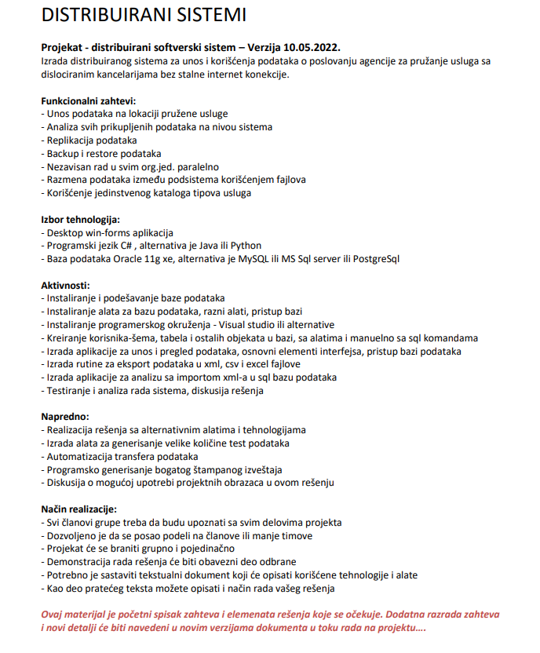

## Introduction

* Distributed system demo application

## Used Tehnology

* Windows Forms App
* C#

## Installation

1. Create 3 separate databases, queries are located in file "queries for database.txt" and there is ER diagram for more information.

2. Change connection strings in ...\DSUMProjekat\Projekat1\DataAccess\Konekcija.cs

```bash
   public static string NazivKonekcije 
        {
            get { return _nazivKonekcije; }
            set
            {
                if(value == "Beograd")
                {
                    ConnectionString = "Data Source = .; Initial Catalog = DSUMBeograd; Integrated Security = True";
                }
                else if(value == "NoviSad")
                {
                    ConnectionString = "Data Source = .; Initial Catalog = DSUMNoviSad; Integrated Security = True";
                }
                else if(value == "Nis")
                {
                    ConnectionString = "Data Source = .; Initial Catalog = DSUMNis; Integrated Security = True";
                }
                else
                {
                    ConnectionString = "";
                }
                _nazivKonekcije = value;
            }
        }
```

3. Start Project

## Description from professor




